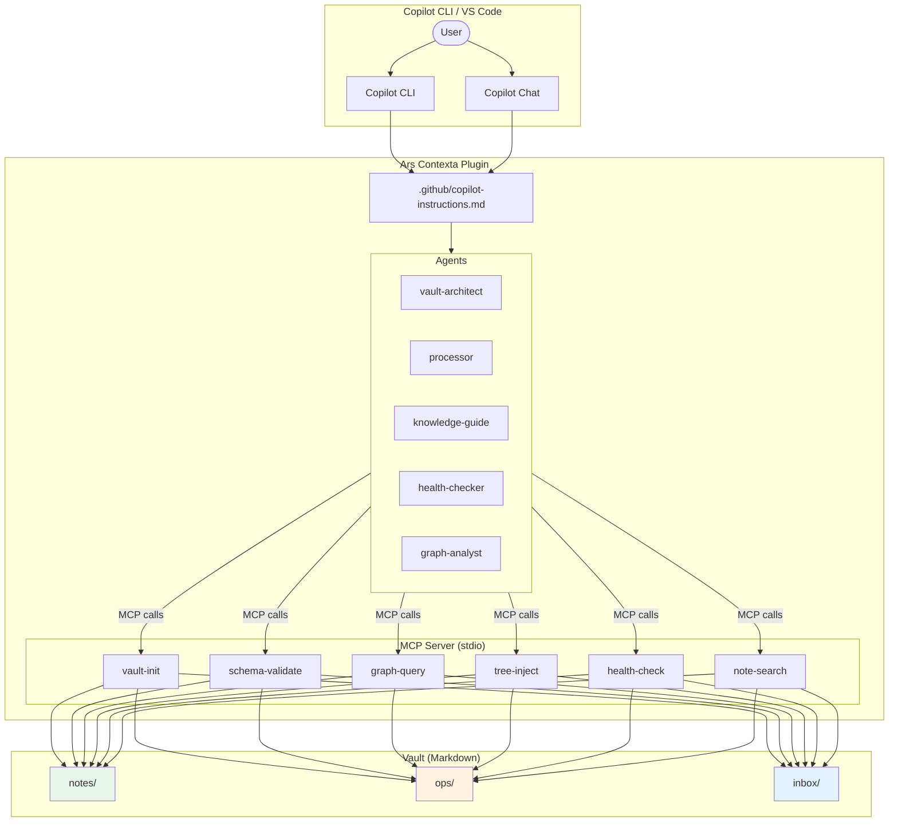
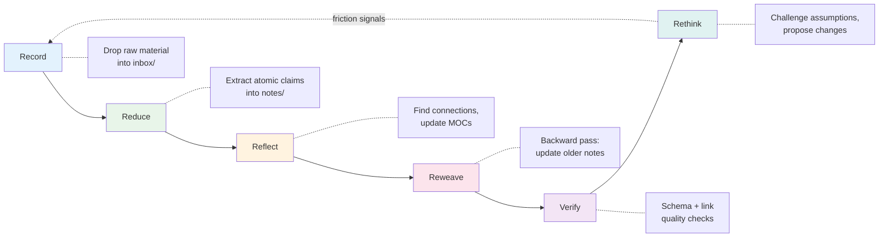
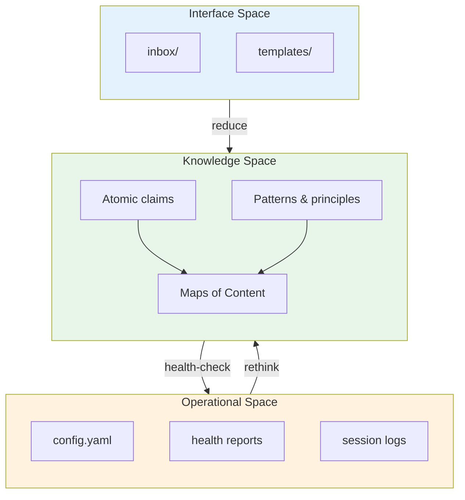
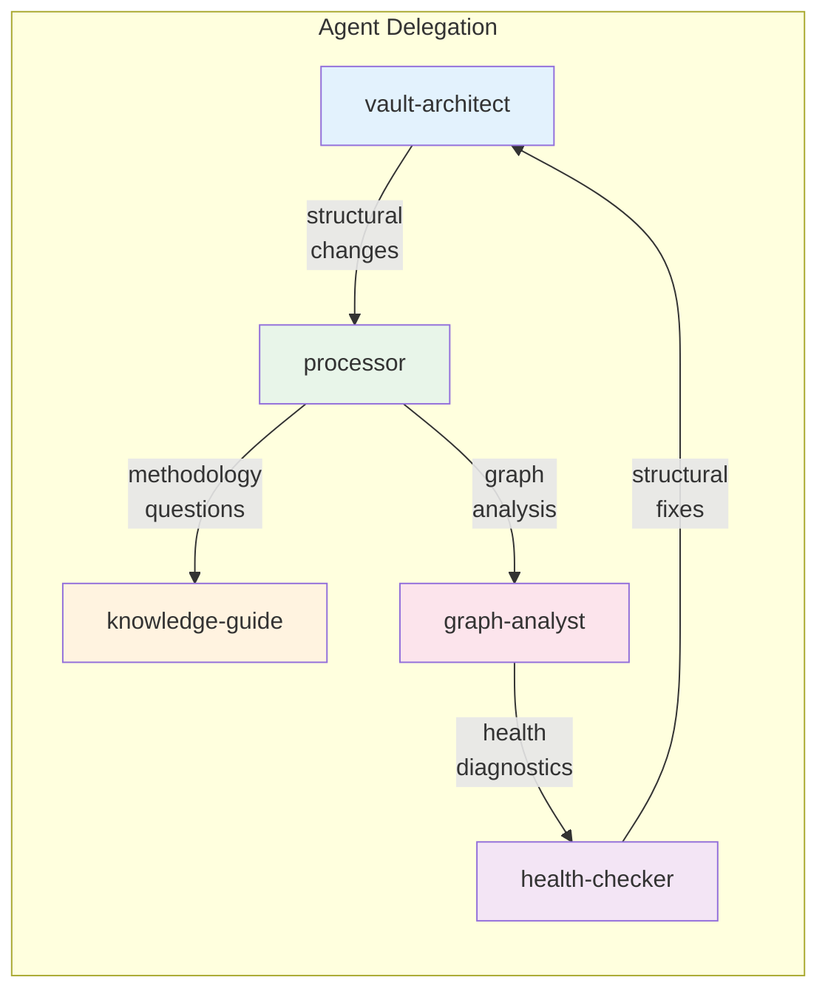
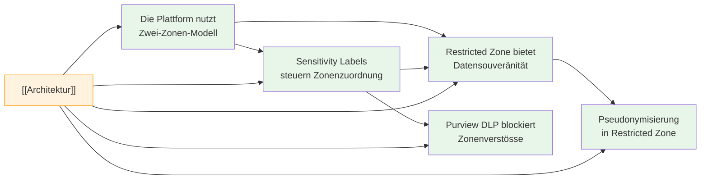
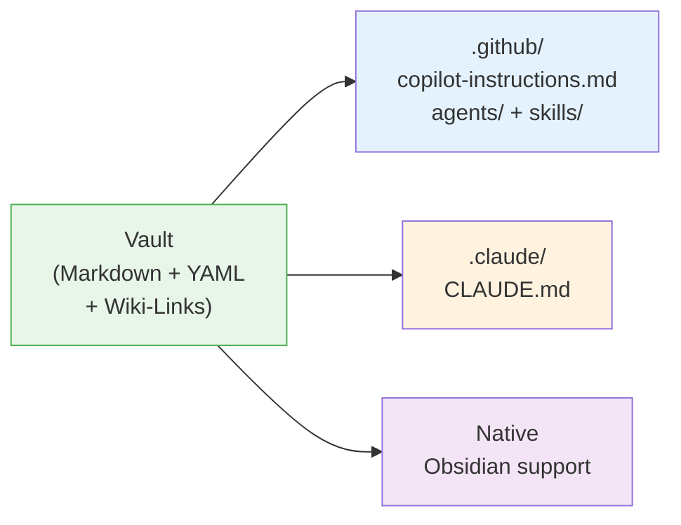

# Ars Contexta — Knowledge Management Plugin for GitHub Copilot

Research-backed knowledge management system that transforms raw material into connected, discoverable knowledge. Portable vaults work across GitHub Copilot, Claude Code, and Obsidian.

## Architecture



## Install

One command:
```bash
copilot plugin install TheTrustedAdvisor/arscontexta
```

That's it. 5 agents + 17 skills + 6 MCP tools, ready to use.

<details>
<summary>Alternative: From source (contributors)</summary>

```bash
git clone https://github.com/TheTrustedAdvisor/arscontexta.git
cd arscontexta
npm install          # builds automatically via prepare script
```

Then point your MCP config at the local build:

```json
{
  "mcpServers": {
    "ars-contexta": {
      "command": "node",
      "args": ["/path/to/arscontexta/dist/server.js"]
    }
  }
}
```
</details>

## Usage

```
> /setup                    — Initialize a research vault
> /reduce docs/report.md    — Extract atomic claims from source material
> /reflect                  — Find connections, update MOCs
> /reweave                  — Update older notes with new context
> /pipeline docs/report.md  — End-to-end: reduce → reflect → reweave → verify
> /health full              — Run vault diagnostics
> /graph clusters           — Find topic clusters in the knowledge graph
```

## Processing Pipeline (6R)



## Three-Space Architecture



## MCP Tools

| Tool | Description |
|------|-------------|
| `setup` | Initialize a new vault with three-space architecture |
| `validate` | Validate a note file against vault schema |
| `graph` | Query the wiki-link graph: orphans, backlinks, density, clusters, suggestions |
| `health` | Run vault diagnostics: schema, orphans, links, descriptions |
| `search` | Search notes by title, content, or frontmatter |
| `tree` | Get the vault directory tree for context injection |

## Agents



| Agent | Purpose |
|-------|---------|
| `vault-architect` | Setup, derivation, structure changes |
| `processor` | Reduce, reflect, reweave pipeline |
| `knowledge-guide` | Methodology guidance, research answers |
| `health-checker` | Diagnostics, schema validation |
| `graph-analyst` | Graph analysis, orphans, connections |

## Skills (17)

| Category | Skills | Description |
|----------|--------|-------------|
| **Processing** | `/setup`, `/reduce`, `/reflect`, `/reweave`, `/verify`, `/pipeline`, `/rethink` | Full 6R pipeline: record → reduce → reflect → reweave → verify → rethink |
| **Analysis** | `/health`, `/graph` | Vault diagnostics and wiki-link graph analysis |
| **Architecture** | `/architect`, `/add-domain`, `/reseed`, `/upgrade`, `/recommend` | Vault evolution, domain expansion, research-backed configuration |
| **Learning** | `/help`, `/ask`, `/tutorial` | Methodology guidance, research Q&A, interactive walkthroughs |

## Vault Format

Vaults use Markdown + YAML frontmatter + wiki-links. See [docs/vault-format-spec.md](docs/vault-format-spec.md) for the full specification.

```
my-vault/
  notes/          # Atomic knowledge claims
  maps/           # Maps of Content (MOCs)
  ops/            # Operational state (config, health, sessions)
  inbox/          # Raw material to process
  templates/      # Note templates
```

Each note follows the **prose-as-title** convention — the filename IS the title:

```markdown
---
description: ~150 chars elaborating the claim
type: claim | pattern | preference | fact | decision | question
created: 2026-05-18
---

# The Two-Zone model enables datenschutzkonforme Cloud extension

Body with reasoning (150-400 words).

---

Source: executive-summary

Relevant Notes:
- [[Sensitivity Labels steuern die Zonenzuordnung automatisch]] -- extends

Topics:
- [[Architektur]]
```

## Wiki-Link Graph



## Vault Portability



The vault format is platform-independent. Platform-specific configuration:

- **Copilot:** `.github/copilot-instructions.md` + `.github/agents/` + `.copilot/mcp-config.json`
- **Claude Code:** `CLAUDE.md` + `.claude/`
- **Obsidian:** Native wiki-link and frontmatter support

## Quality Metrics (E2E Validated)

Tested with Copilot CLI against real enterprise documentation (KTZH Datenplattform v2):

| Metric | Result | Target |
|--------|--------|--------|
| Notes generated | 50 | ~50 |
| Orphan rate | 0.0% | < 5% |
| Schema compliance | 100% | 100% |
| Link health | 100% | > 90% |
| Description quality | PASS | PASS |
| Avg link degree | 4.9 | 2-4 |
| Health score | 5/5 PASS | 5/5 |

## Development

```bash
git clone https://github.com/TheTrustedAdvisor/arscontexta.git
cd arscontexta
npm install              # builds automatically
npm test                 # 91 unit tests
npm run typecheck        # TypeScript check
node test/e2e-smoke.mjs  # E2E integration test
```

## License

MIT
